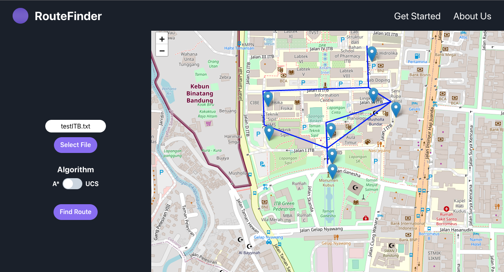

# Tucil3_13521057_13521129
Tugas Kecil 3 IF2211 - Strategi Algoritma
Tahun 2022/2023

## Daftar Isi
* [Deskripsi Persoalan](#deskripsi-persoalan)
* [Keperluan Program](#keperluan-program)
* [Cara Menjalankan Program](#cara-menjalankan-program)
* [Cara Menggunakan Program](#cara-menggunakan-program)
* [Pembuat Program](#pembuat-program)

## Deskripsi Persoalan
Algoritma UCS (Uniform cost search) dan A* (atau A star) dapat digunakan untuk menentukan
lintasan terpendek dari suatu titik ke titik lain. Pada tugas kecil 3 ini, diperlukan sebuah program untuk menentukan
lintasan terpendek berdasarkan peta Google Map jalan-jalan di kota Bandung. Dari ruas-ruas jalan
di peta dibentuk graf. Simpul menyatakan persilangan jalan (simpang 3, 4 atau 5) atau ujung jalan.
Asumsikan jalan dapat dilalui dari dua arah. Bobot graf menyatakan jarak (m atau km) antar simpul.
Jarak antar dua simpul dapat dihitung dari koordinat kedua simpul menggunakan rumus jarak
Euclidean (berdasarkan koordinat) atau dapat menggunakan ruler di Google Map, atau cara
lainnya yang disediakan oleh Google Map.


Langkah pertama di dalam program ini adalah membuat graf yang merepresentasikan peta (di area tertentu, misalnya di sekitar Bandung Utara/Dago). Berdasarkan graf yang dibentuk, lalu program menerima input simpul asal dan simpul tujuan, lalu menentukan lintasan terpendek antara keduanya menggunakan algoritma UCS dan A*. Lintasan terpendek dapat ditampilkan pada peta/graf (misalnya jalan-jalan yang menyatakan lintasan terpendek diberi warna merah). Nilai heuristik yang dipakai adalah jarak garis lurus dari suatu titik ke tujuan.

## Keperluan Program
1. node.js
2. npm
3. typescript

## Cara Menjalankan Program
1. Pastikan berada pada *directory* 
```Tucil3_13521057_13521129/src/frontend``` atau gunakan *command* ```cd ./src/frontend/``` pada *root repository*
2. install dependencies
```npm i```
3. run app
```npm start```

## Cara Menggunakan Program
Setelah program dijalankan, akan terbuka tampilan seperti berikut

</img>

1. Tekan 'Get Started' dan tampilan menjadi seperti berikut

</img>

2. Pilih 'Input File' atau 'Maps'
3. Untuk 'Input File' tampilan akan menjadi seperti berikut

</img>

4. Masukkan *file* dengan menekan tombol 'Select File' dan pilih algoritma yang diinginkan dengan mengubah *switch*

</img>

**NOTE** : Format penulisan file .txt sebagai berikut
***
[jumlah node (n)]

[nama node (1)] [koordinat x] [koordinat y]

...

[nama node (n)] [koordinat x] [koordinat y]

[adjacency (1,1)]|[adjacency (1,2)]| ... |[adjacency (1,n)]

...

[adjacency (n,1)]|[adjacency (n,2)]| ... |[adjacency (n,n)]
***
**adjacency diisi dengan 'X' jika tidak berisisian atau nama jalan (tanpa spasi) jika bersisian** 
contoh:
***
8

1_GerbangDepan -6.893036 107.610444

2_PertigaanFSRD -6.892621 107.610425

3_PertugaanLapcin -6.891930 107.610398

4_BelakangSAPPK -6.891360 107.612171

5_cibe -6.891988 107.608708

6_GKUB -6.891077 107.608681

7_Labtek8 -6.890976 107.611557

8_SF -6.889858 107.611509

X|AB|X|X|X|X|X|X

AB|X|BC|BD|BE|X|X|X

X|BC|X|CD|X|X|X|X

X|BD|CD|X|X|X|DH|X

X|BE|X|X|X|EF|X|X

X|X|X|X|EF|X|FG|X

X|X|X|DH|X|FG|X|GH

X|X|X|X|X|X|GH|X
***
**Perhatikan juga bahwa** rute diarahkan dari *node* pertama ke *node* terakhir pada *file input*

5. Tekan 'Find Route' untuk memulai pencarian dan tampilan akan menampilkan solusi pada peta seperti berikut

</img>

## Pembuat Program
* Hosea Nathanael Abetnego (13521057)
* Chiquita Ahsanunnisa (1352129)
